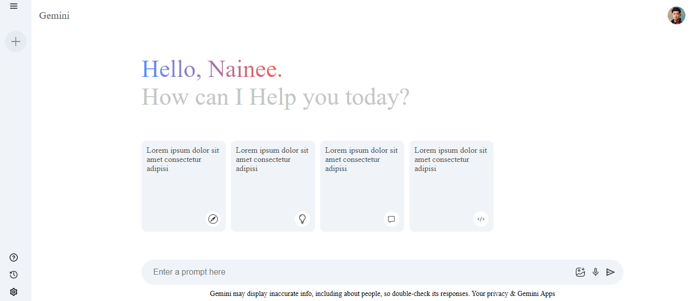

Here’s the corrected version of your `README.md` with proper Markdown syntax:

```markdown
# Gemini Clone - AI Chatbot



## Overview

The **Gemini Clone** is a React.js-based AI chatbot inspired by the Gemini platform. It uses an LLM (Large Language Model) to simulate intelligent conversations and provide meaningful responses to user queries. The project integrates with the Gemini API and CSS for seamless interaction and styling.

## Features

- **Conversational AI**: Powered by an LLM for realistic and intelligent chatbot interactions.
- **Real-Time Data**: Uses the Gemini API to fetch live cryptocurrency or relevant market data during conversations.
- **Responsive Design**: Styled with CSS for a clean, modern, and responsive user interface.
- **Dynamic Updates**: Updates responses based on user input and API-provided data.

## Getting Started

### Prerequisites

Ensure you have the following installed on your machine:

- [Node.js](https://nodejs.org/) (version 14 or higher)
- [npm](https://www.npmjs.com/) or [yarn](https://yarnpkg.com/)
- An API key for the Gemini platform.

### Installation

1. Clone the repository:

   ```bash
   git clone https://github.com/Nainee99/Gemini-Clone.git
   ```

2. Navigate to the project directory:

   ```bash
   cd Gemini-Clone
   ```

3. Install the dependencies:

   ```bash
   npm install
   ```

4. Add your environment variables in a `.env` file at the root:

   ```plaintext
   REACT_APP_GEMINI_API_KEY=your_gemini_api_key
   ```

5. Start the application:

   ```bash
   npm run dev
   ```

6. Open your browser and go to `http://localhost:5173` to use the chatbot.

## Project Structure

```
├── public/
│   └── gemini-clone.png   # Screenshot of the application
├── src/
│   ├── components/        # React components
│   ├── styles/            # CSS for styling
│   ├── services/          # API and LLM integration
│   └── App.js             # Main app logic
├── package.json           # Project dependencies
├── .env                   # Environment variables
└── README.md              # Project documentation
```

## Technologies Used

- **Frontend**: React.js
- **Styling**: CSS
- **Data Fetching**: Gemini API

## How to Use

1. Launch the app in your browser.
2. Interact with the chatbot by typing your questions or commands in the input box.
3. Receive real-time responses from the chatbot, including data fetched from the Gemini API.

## Screenshot


## License

This project is licensed under the MIT License. See the [LICENSE](LICENSE) file for more details.